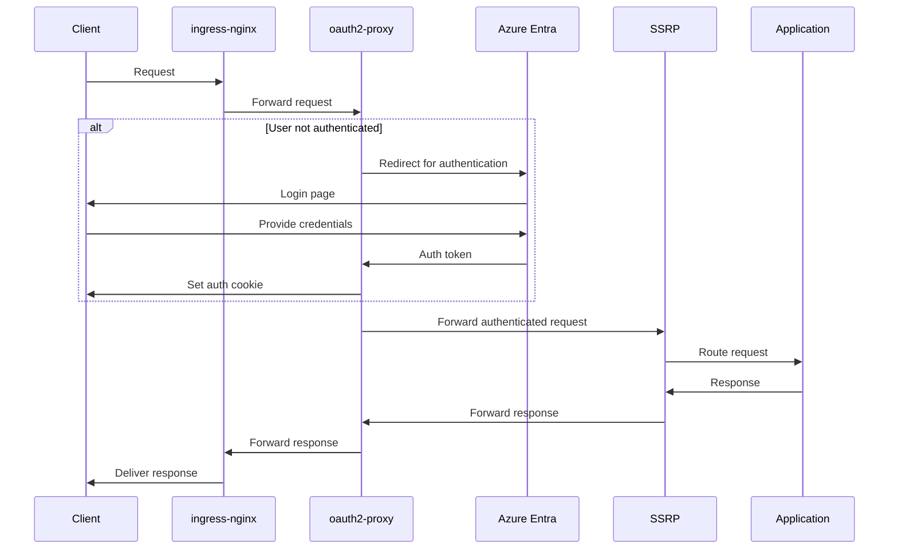

# SIMPLE SECURE REVERSE PROXY

## Introduction

Or at least i hope it is simple.
ssrp is a reverse proxy specifically made to be stupidly simple to proxy based on a header containing a value in a list of values (comma separated).

so if a request has `x-groups: one,two,three` and we run with `-g one` the request will be allowed, however if we use `-g four` in this example the request will be denied.

## usage

```bash
> ssrp -h
Usage of ./ssrp:
  -g, --group strings   Allowed groups (can be specified multiple times)
  -i, --insecure        Ignore SSL certificate errors
  -l, --listen string   Address to listen on (default ":3000")
  -t, --target string   Target URL to proxy to (default "localhost:8080")
```

## schematic overview


